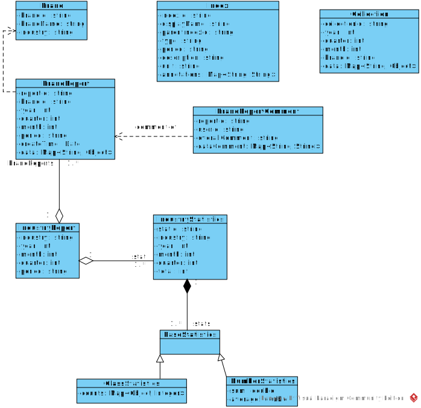

# 设计说明

## 领域模型

更新后的领域类图如上图所示。

### Index类

Index类为竞争力指标元数据类，保存着指标的名称、详细说明、类型、单位等。指标中的annotations用于存放额外的元数据信息，提供给其他子系统运算的时候使用，比如对于算分系统，保存使用的算分算法和具体的参数。

指标类中包含的period，代表这个指标数据统计的时长，如月度指标，年度指标与季度指标，这个时长也会在报告和数据中记录。

### IndustryStatistics类

本类保存有关行业数据统计信息的类，具体的统计数据存储在stats中。stats是键为indexId，值为BaseStatistics的映射表。

BaseStatistics是统计数据的基类，为了支持多种类型的统计，使用了继承的方式，派生出多种统计类型，如ClassStatistics代表那些取值有限的指标，每一个取值的品牌总数，由此可以得出各个取值的比例，和具体取值的数据。而NumberStatistics则用于数字类型的取值，计算该指标总值和平均值。

### Brand类

即品牌类，保存品牌名、行业等

### BrandReport类

单个品牌报告类，保存着品牌Id，品牌报告的统计时长，以及本品牌报告的时间（年份、月份与季度），data中保存着本报告的所有数据。

品牌报告的数据，通常来自Collection类对象存储的数据，以及经过其他系统（统计系统、计分系统）等计算处理得到的数据。

### IndustryReport类

行业报告类，除了时间外和行业内品牌的报告外，也附带本行业的统计信息。

### Collection类

品牌在一段统计时间的数据的集合。本系统将数据和报告分开存储，所有的原始数据就放在Collection类中。数据经过计算处理后放置到品牌报告或行业报告中。